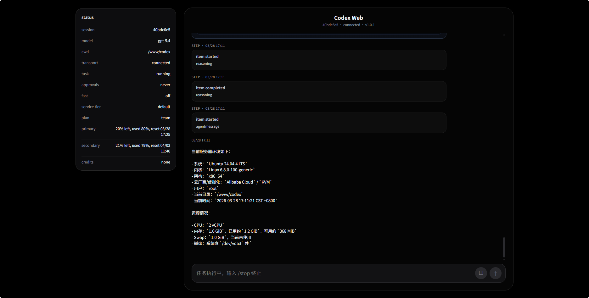
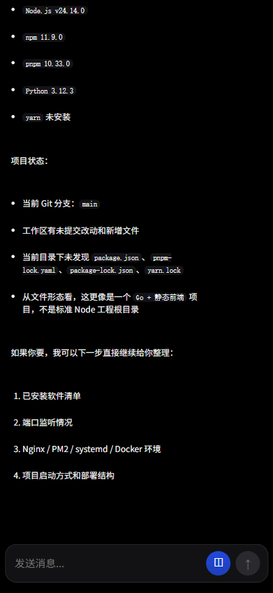

<p align="right">
  <a href="./README.md">中文</a> | English
</p>

# codex-web

`codex-web` is a Codex Web UI built with `Go + HTML + WebSocket`.

It targets both mobile and desktop browsers and provides a continuous session experience close to Codex CLI:

- Tasks keep running on the server after the browser is closed
- Reopening the page restores the latest chat automatically
- The same session reuses the same Codex thread and keeps context

## Screenshots

### Desktop



### Mobile



## Features

- Built on top of `codex app-server`, not a fresh standalone CLI run per message
- Session persistence in `data/sessions/*.json`
- Supports sending images together with messages
- Supports streaming output, `Working...` status, and auto reconnect
- Supports basic Markdown rendering
- Frontend static assets are embedded into the Go binary

## Currently Supported Commands

- `/status`
- `/model`
- `/fast`
- `/skills`
- `/resume`
- `/clear`
- `/compact`
- `/stop`
- `/delete`
- `/new`
- `/logout`

Some of these are local UI commands, while others call backend APIs or `codex app-server`.

## Requirements

1. Go `1.22+`
2. `codex` must be executable on the machine
3. `codex login` must already be completed

## Start

```bash
go build -o codex-web .
./codex-web
```

The built `codex-web` binary already contains the frontend static assets. For deployment you only need the binary itself and the runtime `data/` directory.

Default listen address:

```text
0.0.0.0:991
```

Default app-server endpoint:

```text
ws://127.0.0.1:8765
```

That means it will try to connect to the local `codex app-server`.

## Login Password

You can set the login password with a startup flag:

```bash
./codex-web -password "123456"
```

If not specified, the default password is:

```text
codex
```

## Access

Open this URL in your browser:

```text
http://YOUR_SERVER_IP:991
```

After login:

- If the browser still has a valid local `sessionId`, it will enter that session directly
- If there is no local session, or the session was deleted, it will enter the “new session / restore session” page

## Working Directory

When creating a new session, you can enter a working directory such as:

```text
/home/codex
```

This directory is stored per session and affects:

- `cwd` shown in `/status`
- The working directory used by later Codex conversations
- The `cwd` sent to `thread/start` and `thread/resume`
- Tasks that depend on the working directory, such as `/review`

## Data Directories

- Session data: `data/sessions/`
- Uploaded images: `data/uploads/`

## Reverse Proxy

If you put it behind Nginx, you at least need to forward WebSocket traffic:

```nginx
location / {
    proxy_pass http://127.0.0.1:991;
    proxy_http_version 1.1;
    proxy_set_header Upgrade $http_upgrade;
    proxy_set_header Connection "upgrade";
    proxy_set_header Host $host;
}
```

## Notes

- This project is not an official OpenAI product
- It is a Codex Web wrapper intended for personal deployment
- The current implementation prioritizes continuous sessions, recovery, and mobile usability

## License

This project is licensed under `MIT`. See [LICENSE](/www/codex/LICENSE).
